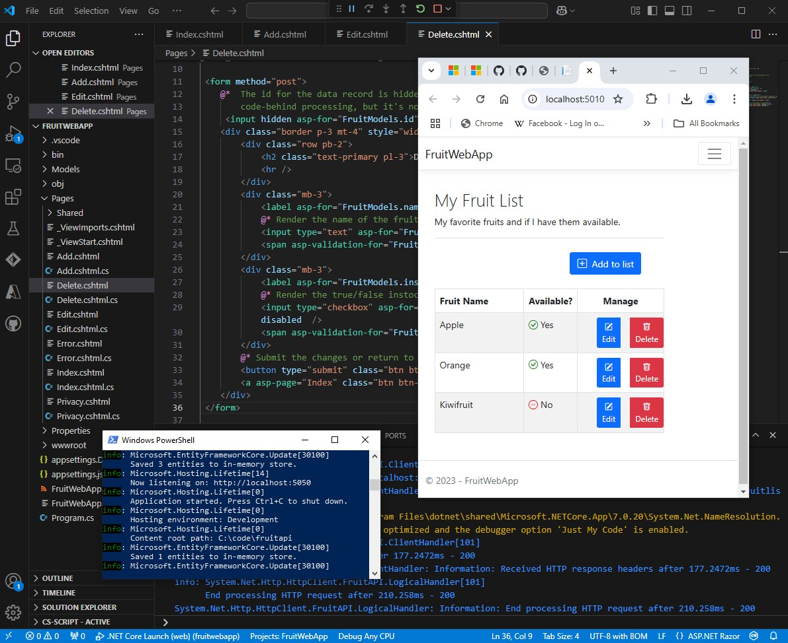

Exercise from the Microsoft training module:

# Render API responses in ASP.NET Core Razor Pages

This module was part of the Microsoft Learn Challenge: "Build AI apps with Microsoft Azure services"
that I have compeleted.

# Module content:

Razor Pages is a page-based programming model that makes it easy to build dynamic web pages. 
Razor Pages are built on top of the Razor syntax, which is a powerful templating language that 
allows you to create HTML markup with C# code.

- Combine HTML and C# to define dynamic page rendering logic
- Render API responses in Razor Pages
- Create pages that perform HTTP operations

This exercise was two components:

A web app that sends HTTP requests to an API (Fruit web app). The app runs on http://localhost:5010 
An API that responds to HTTP requests (Fruit API). The API runs on http://localhost:5050

The Fruit web app displays the API sample data on the home page (Index.cshtml). The add, edit, and delete operations are each 
handled on a separate .cshtml page in the project (Add.cshtml, Edit.cshtml and Delete.cshtml).  

